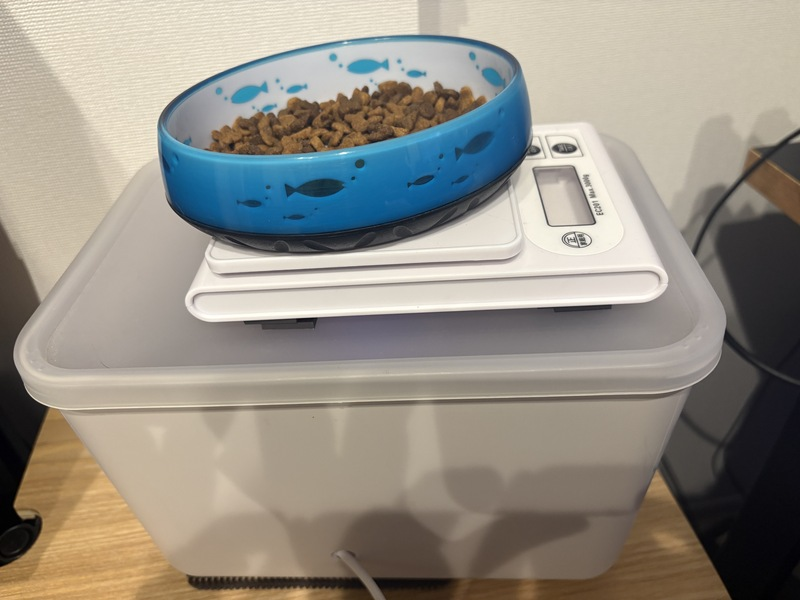
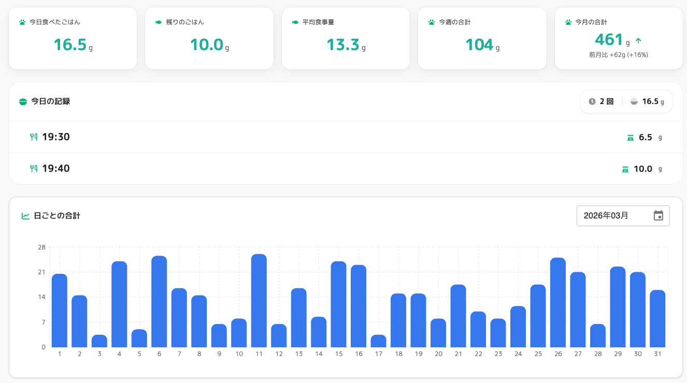
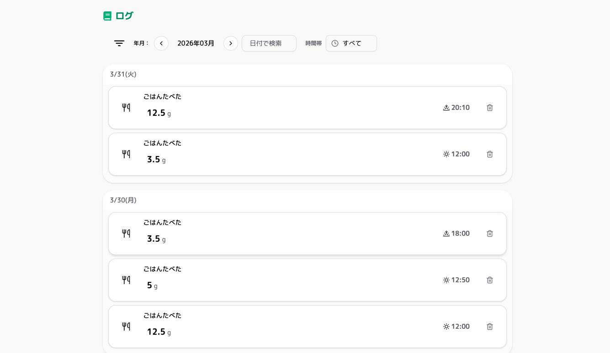
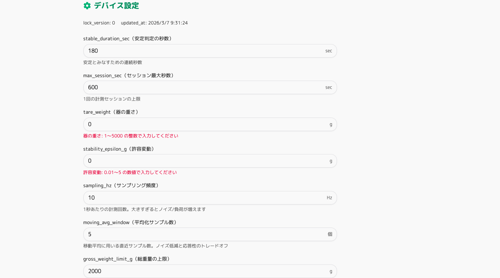
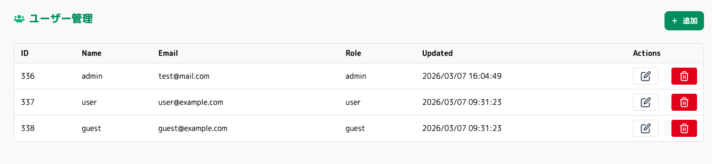
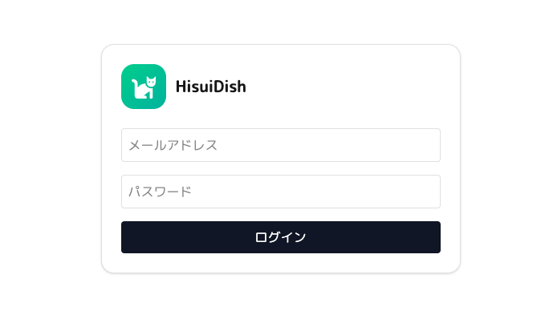

# HisuiDish

HisuiDish は、猫の食事量を Raspberry Pi と重量センサーで計測し、Web で記録と可視化を行うアプリです。

## できること

- 食事イベントの記録
- 今日の食事一覧と合計量の表示
- 日別、週別、月別の集計表示
- ログ一覧の確認と削除
- デバイス設定の取得と更新
- Raspberry Pi 側設定の同期

## 使用技術

| レイヤ   | 主な技術                                           |
| -------- | -------------------------------------------------- |
| Device   | Python 3.12, Raspberry Pi 5, HX711                 |
| Backend  | Laravel 12, PHP 8.5-rc, PostgreSQL 16              |
| Frontend | React 19.1, TypeScript 5.8, Vite 7.1, Tailwind CSS |
| Infra    | Docker Compose                                     |

## Device (Raspberry Pi 5)

Raspberry Pi 5 と HX711 を使って、食器の重量変化を計測するデバイスを構成しています。  
重量の変化から食事イベントを検知し、確定したデータを Web API に送信する役割です。

### Deviceイメージ

### 簡単な構成

- ダイソーのキッチンスケールを開けて分解し、内部配線にはんだ付けをして、ロードセルを HX711 と接続しています
- HX711 はキッチンスケール内部に収めています
- Raspberry Pi はダイソーの箱の中に収めており、計測値の処理と API 送信を担当します
- ケースにはダイソーの箱を使い、側面に配線用のコードを通す穴、蓋にキッチンスケール内の HX711 と Raspberry Pi を接続するための穴を開けています
- 蓋とキッチンスケールの両方にマグネットを貼り付けて、使用中にずれたり揺れたりしにくいようにしています
- 底面にはすべり止めを貼り、設置時の揺れや滑りによるノイズを減らしやすくしています

- Raspberry Pi 5 上で Python アプリを実行
- ロードセル + HX711 で重量を取得
- 重量変化を監視して食事イベントを判定
- API へイベント送信
- 食事イベント後または5分おきに、お皿にあるごはんの残量を送信
- DeviceSettings を定期同期して、再起動なしで設定を反映

## 画面

### Dashboard

デバイスで計測した結果をグラフなどで確認することができるページです。

- 今日食べたごはん
- 残りのごはん
- 平均食事量
- 週次 / 月次 / 年次の集計

### Logs

デバイスで計測した内容をログ単位で確認できるページです。

- 食事ログ一覧
- ログ削除
- ログのフィルター

### Settings

デバイスの設定内容を変更できるページです。

- デバイス設定の編集

### Users

ユーザーの管理ページです。
管理者アカウントのみ閲覧、更新ができます。

- ユーザーの登録
- ユーザーの設定変更
- ユーザーの削除

### Login

ログイン画面です。

- ログイン

### 材料

- Raspberry Pi 5
- HX711
- [キッチンスケール（ダイソー）](https://jp.daisonet.com/products/4550480215112?srsltid=AfmBOorC-6wD6_w1BPhPsYgIllSHico7e3KswXH_aysPnY6zkoWx48WO)
- [Ｒ３０ボックス](https://jp.daisonet.com/products/4550480065922)
- [強磁力　マグネットタックピース　厚手タイプ　２０Ｐ](https://jp.daisonet.com/products/4954939031849?_pos=52&_sid=09325b66b&_ss=r)
- [粘着付きマグネットシート](https://jp.daisonet.com/products/4984343878372?_pos=6&_sid=730f0f91b&_ss=r)
- [すべり止めマット（ミニタイプ、３枚）](https://jp.daisonet.com/products/4550480256207?_pos=1&_sid=d23dc5a57&_ss=r)

## 今後やりたいこと

- ごはん追加イベントの検知
- 残量が少ない状態の通知
- 健康管理ページ
- デバイスの状況の表示機能（通信）
